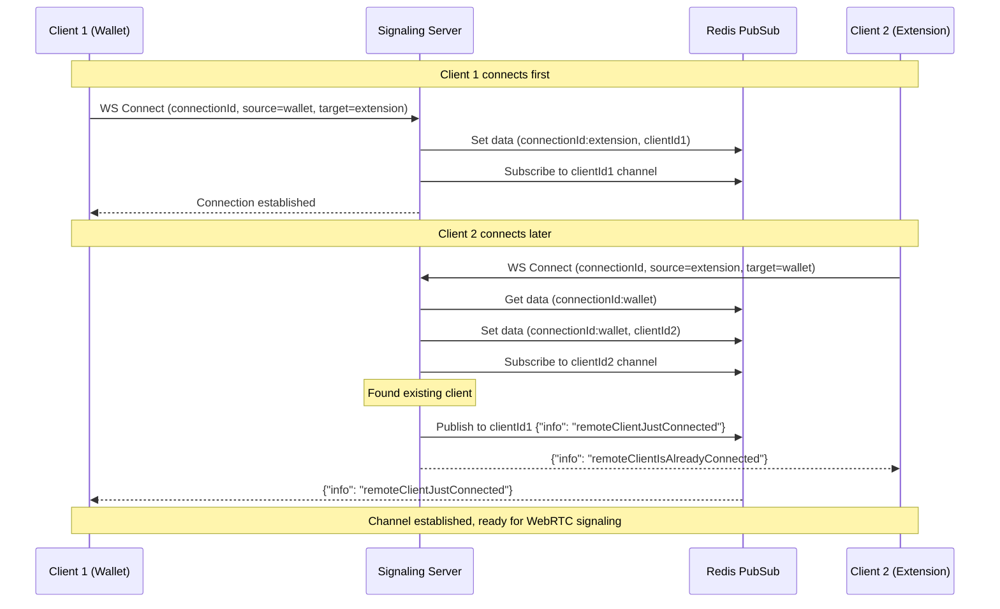

# Signaling server

Used for negotiations of WebRTC channel between [Connector Extension](https://github.com/radixdlt/connector-extension) or headless radix connect and [Radix Wallet](https://github.com/radixdlt/babylon-wallet-ios). Its client is implemented in [radix-connect-webrtc](https://github.com/radixdlt/radix-connect-webrtc) inside [SignalingClient](https://github.com/radixdlt/radix-connect-webrtc/blob/main/src/connector/signaling/signaling-client.ts) or in [babylon ios wallet example](https://github.com/radixdlt/babylon-wallet-ios/blob/030f7667e49543b3d3d6eb9b618d98bdfe24a14b/RadixWallet/RadixConnect/RadixConnect/RTC/SignalingClient/SignalingClient.swift#L14)

## Architecture

The server uses a distributed architecture where multiple instances can run simultaneously, communicating through Redis pub/sub. This allows for:

- Horizontal scalability
- High availability
- Load balancing
- Session persistence

### Message Types Supported

- WebRTC Offers
- WebRTC Answers
- ICE Candidates
- Connection status updates

## Negotiation diagram

## Development Setup

`yarn install`

### Running Docker Containers

_You'll need docker installed on your machine to run this!_

### Build the image

`docker-compose build`

### Start the dev server and Redis instance

`make up`

## Running Tests

`make up-test` - run two local Signaling Server instances and redis instance
`yarn test` - execute tests

## Additional commands

### Build and start dev server

`make up-build`

### Stream logs

`make logs`

### Stop the server

`make down`

### Build and start production build

`make up-prod`

